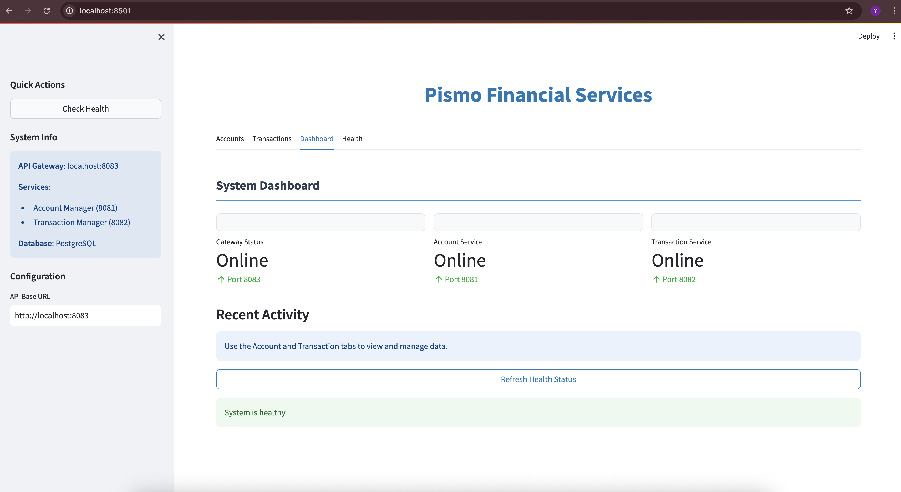
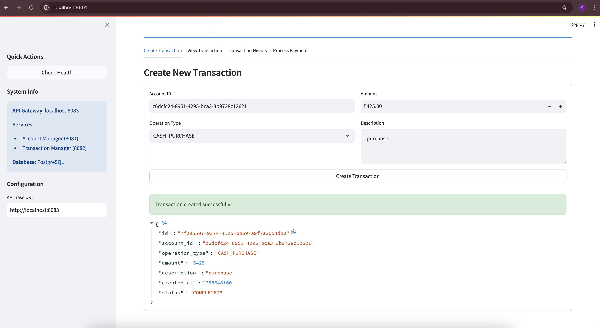
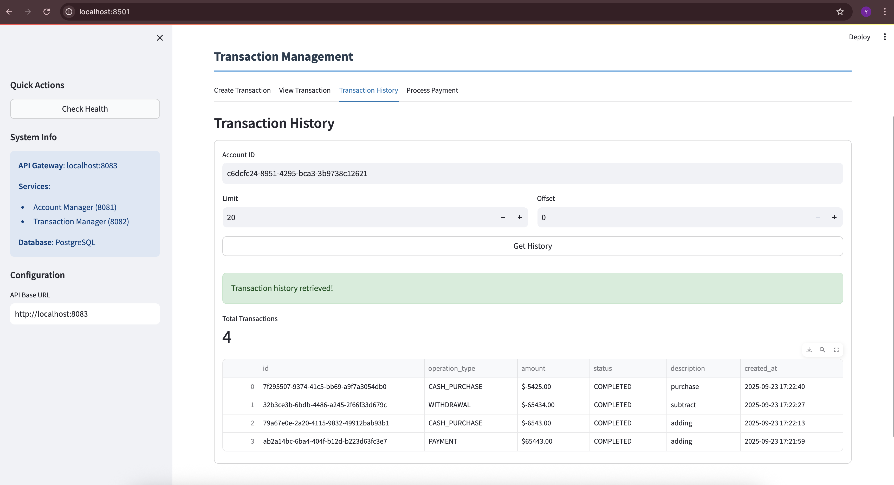

# Pismo Financial Services - Microservices Architecture

A comprehensive microservices-based financial services platform built with Go, featuring account management, transaction processing, and a unified PostgreSQL database. This implementation demonstrates modern software architecture principles including service-oriented design, gRPC communication, REST APIs, and comprehensive testing.

## Table of Contents

- [Overview](#overview)
- [Architecture](#architecture)
- [Services](#services)
- [Project Structure](#project-structure)
- [Database Schema](#database-schema)
- [API Documentation](#api-documentation)
- [Installation](#installation)
- [Usage](#usage)
- [Testing](#testing)
- [Deployment](#deployment)
- [Development](#development)
- [Contributing](#contributing)
- [License](#license)

## Overview

This project implements a complete financial services platform using a microservices architecture. The system handles account management, transaction processing, and provides both REST and gRPC APIs for client integration. Built with Go and PostgreSQL, it demonstrates best practices in modern software development including clean architecture, comprehensive testing, and containerization.

## User Interface

The application includes a modern web-based UI built with Streamlit that provides an intuitive interface for testing and managing the financial services platform. The interface is accessible at `http://localhost:8501` and provides comprehensive functionality for all system operations.

### Dashboard Overview

*System dashboard showing service status and health monitoring with real-time service indicators*

### Account Management

#### Account Creation

*Account creation form with document number validation and account type selection*

#### Account View

*Account details display showing account information and metadata*

#### System Monitoring

*System monitoring interface showing status of all three services (Gateway, Account Manager, Transaction Manager)*

### Transaction Management

#### Transaction Creation

*Transaction creation form with operation type selection and amount input*

#### Transaction View

*Transaction details display with comprehensive transaction information*

#### Transaction History

*Transaction history table with pagination and filtering capabilities*

### System Health Monitoring

*Real-time health status of all services and database connectivity with detailed system information*


### Screenshot Gallery

The following screenshots demonstrate the complete functionality of the Pismo Financial Services platform:

| Feature | Screenshot | Description |
|---------|------------|-------------|
| **Dashboard** |  | System overview with service status |
| **Account Creation** |  | Create new accounts with validation |
| **Account View** |  | View account details and metadata |
| **Transaction Creation** |  | Process financial transactions |
| **Transaction View** |  | View transaction details |
| **Transaction History** |  | Browse transaction history |
| **System Monitoring** |  | Monitor all three services status |
| **Health Monitoring** |  | Monitor system health |

### Interface Features

The web interface provides the following key features:

- **Interactive Dashboard**: Real-time monitoring of all services with status indicators
- **Account Operations**: Complete account lifecycle management with validation
- **Transaction Processing**: Full transaction workflow with history tracking
- **Health Monitoring**: Comprehensive system health checks and status reporting
- **Responsive Design**: Clean, modern interface optimized for different screen sizes
- **Real-time Feedback**: Success/error messages and live data updates

### Key Features

- **Microservices Architecture**: Three independent services with clear separation of concerns
- **Dual API Support**: Both REST HTTP and gRPC interfaces
- **Comprehensive Testing**: Unit tests with 95%+ code coverage across all modules
- **Database Integration**: PostgreSQL with ACID transactions and data consistency
- **Containerization**: Docker support for all services
- **Health Monitoring**: Built-in health checks and monitoring capabilities
- **Web Interface**: Streamlit-based UI for interactive testing and demonstration

## Architecture

The system consists of three microservices that communicate via gRPC:

### System Architecture Overview

```
┌─────────────────────────────────────────────────────────────────────────────────┐
│                              PISMO FINANCIAL SERVICES                          │
│                              MICROSERVICES ARCHITECTURE                        │
└─────────────────────────────────────────────────────────────────────────────────┘

┌─────────────────┐    ┌─────────────────┐    ┌─────────────────┐    ┌─────────────────┐
│   External      │    │   Gateway       │    │   Account       │    │   Transaction   │
│   Clients       │    │   Service       │    │   Manager       │    │   Manager       │
│                 │    │   (Port 8083)   │    │   (Port 8081)  │    │   (Port 8082)  │
│  - Web Apps     │    │                 │    │                 │    │                 │
│  - Mobile Apps  │    │  - HTTP-to-gRPC │    │  - Account CRUD │    │  - Transaction  │
│  - Third-party  │    │    Bridge       │    │  - Balance Mgmt │    │    Processing   │
│    Services     │    │  - REST API     │    │  - Validation   │    │  - History      │
└─────────────────┘    │  - CORS Support │    │  - Health Check │    │  - Status Track │
         │              └─────────────────┘    └─────────────────┘    └─────────────────┘
         │                       │                       │                       │
         │ HTTP REST API          │ gRPC                  │ gRPC                  │ gRPC
         │                        │                       │                       │
         ▼                        ▼                       ▼                       ▼
┌─────────────────────────────────────────────────────────────────────────────────┐
│                              UNIFIED DATABASE LAYER                            │
│                                                                                 │
│  ┌─────────────────────────────────────────────────────────────────────────┐   │
│  │                        PostgreSQL Database                              │   │
│  │                           (Port 5432)                                   │   │
│  │                                                                         │   │
│  │  ┌─────────────────┐              ┌─────────────────┐                   │   │
│  │  │   Accounts       │              │   Transactions  │                   │   │
│  │  │   Table          │              │   Table          │                   │   │
│  │  │                  │              │                  │                   │   │
│  │  │  - id (PK)       │              │  - id (PK)      │                   │   │
│  │  │  - document_num  │              │  - account_id   │                   │   │
│  │  │  - account_type  │              │  - operation    │                   │   │
│  │  │  - balance       │              │  - amount       │                   │   │
│  │  │  - timestamps    │              │  - description  │                   │   │
│  │  │                  │              │  - status       │                   │   │
│  │  │                  │              │  - timestamps   │                   │   │
│  │  └─────────────────┘              └─────────────────┘                   │   │
│  │           │                                 │                           │   │
│  │           └───────── FOREIGN KEY ───────────┘                           │   │
│  └─────────────────────────────────────────────────────────────────────────┘   │
└─────────────────────────────────────────────────────────────────────────────────┘

┌─────────────────────────────────────────────────────────────────────────────────┐
│                              SUPPORTING SERVICES                               │
│                                                                                 │
│  ┌─────────────────┐              ┌─────────────────┐                        │
│  │   Health Check  │              │   Web UI        │                        │
│  │   Service       │              │   (Streamlit)   │                        │
│  │                 │              │                 │                        │
│  │  - DB Ping      │              │  - Interactive  │                        │
│  │  - Basic Health │              │    Dashboard     │                        │
│  │  - Timeout      │              │  - Transaction   │                        │
│  │    Support      │              │    Management    │                        │
│  │                 │              │  - Account       │                        │
│  │                 │              │    Operations    │                        │
│  │                 │              │  - Health        │                        │
│  │                 │              │    Monitoring    │                        │
│  └─────────────────┘              └─────────────────┘                        │
└─────────────────────────────────────────────────────────────────────────────────┘

┌─────────────────────────────────────────────────────────────────────────────────┐
│                              DATA FLOW PATTERNS                                │
│                                                                                 │
│  1. CLIENT REQUEST FLOW:                                                       │
│     Client → Gateway → Account/Transaction Manager → Database                   │
│                                                                                 │
│  2. TRANSACTION PROCESSING:                                                     │
│     Create Transaction → Validate Account → Update Balance → Record History   │
│                                                                                 │
│  3. HEALTH MONITORING:                                                          │
│     Health Check → Database Ping → Service Status → Response                   │
│                                                                                 │
│  4. ERROR HANDLING:                                                             │
│     Error Detection → HTTP Error Response → Client Notification                │
└─────────────────────────────────────────────────────────────────────────────────┘
```

### Technology Stack

- **Backend**: Go 1.21+
- **Database**: PostgreSQL 14+
- **Communication**: gRPC for inter-service communication
- **API**: REST HTTP for external clients
- **Protocol Buffers**: For service definitions and data serialization
- **Containerization**: Docker
- **Testing**: Go testing framework with sqlmock
- **UI**: Streamlit for web interface

## Services

### Gateway Service (Port 8083)
The Gateway Service acts as the entry point for external clients, providing a REST HTTP API that routes requests to the appropriate microservices.

**Responsibilities:**
- HTTP REST API endpoint management
- Request routing to Account and Transaction services
- CORS support for web applications
- Error handling and response formatting
- Health check endpoint for monitoring

**Key Features:**
- RESTful API design following HTTP standards
- Automatic service discovery and routing
- Comprehensive error handling with proper HTTP status codes
- CORS configuration for cross-origin requests

### Account Manager Service (Port 8081)
The Account Manager Service handles all account-related operations including creation, retrieval, updates, and balance management.

**Responsibilities:**
- Account lifecycle management (CRUD operations)
- Balance tracking and validation
- Account type management (CHECKING, SAVINGS, CREDIT)
- Document number validation and uniqueness
- Account status monitoring

**Key Features:**
- Complete CRUD operations for accounts
- Balance validation and constraints
- Account type enforcement
- Unique document number validation
- Timestamp tracking for audit trails

### Transaction Manager Service (Port 8082)
The Transaction Manager Service processes all financial transactions and maintains transaction history.

**Responsibilities:**
- Transaction processing and validation
- Operation type handling (PAYMENT, CASH_PURCHASE, INSTALLMENT_PURCHASE, WITHDRAWAL)
- Balance updates and consistency checks
- Transaction history management
- Payment processing

**Key Features:**
- Multiple transaction operation types
- Automatic balance updates
- Insufficient balance validation
- Transaction status tracking
- Paginated transaction history
- Payment processing with validation

## Project Structure

```
pismo-task/
├── cmd/                          # Main application entry points
│   ├── account-mgr/              # Account management service
│   │   ├── main.go              # Service entry point with protobuf generation
│   │   ├── go.mod               # Service-specific dependencies
│   │   ├── go.sum               # Dependency checksums
│   │   └── Dockerfile           # Container configuration
│   ├── transaction-mgr/          # Transaction processing service
│   │   ├── main.go              # Service entry point with protobuf generation
│   │   ├── go.mod               # Service-specific dependencies
│   │   ├── go.sum               # Dependency checksums
│   │   └── Dockerfile           # Container configuration
│   └── gateway/                  # HTTP API gateway
│       ├── main.go              # Gateway entry point
│       ├── go.mod               # Gateway dependencies
│       ├── go.sum               # Dependency checksums
│       └── Dockerfile           # Container configuration
├── internal/                     # Private application packages
│   ├── common/                   # Shared utilities and models
│   │   ├── database.go          # Database connection management
│   │   ├── database_test.go     # Database utility tests
│   │   ├── orm.go               # Database models and utilities
│   │   ├── orm_test.go          # ORM utility tests
│   │   ├── go.mod               # Common package dependencies
│   │   └── go.sum               # Dependency checksums
│   ├── account/                  # Account business logic
│   │   ├── account.go           # Account service implementation
│   │   ├── account_test.go      # Account service tests
│   │   ├── proto_db.go          # Protobuf conversion utilities
│   │   ├── go.mod               # Account package dependencies
│   │   └── go.sum               # Dependency checksums
│   ├── transaction/              # Transaction business logic
│   │   ├── transaction.go       # Transaction service implementation
│   │   ├── transaction_test.go  # Transaction service tests
│   │   ├── proto_db.go          # Protobuf conversion utilities
│   │   ├── go.mod               # Transaction package dependencies
│   │   └── go.sum               # Dependency checksums
│   └── health/                   # Health check utilities
│       ├── health.go            # Health check implementation
│       ├── health_test.go       # Health check tests
│       ├── go.mod               # Health package dependencies
│       └── go.sum               # Dependency checksums
├── proto/                        # Protocol buffer definitions
│   ├── account/                  # Account service protobuf definitions
│   │   ├── account.proto        # Account service schema
│   │   ├── account.pb.go        # Generated Go code
│   │   ├── account_grpc.pb.go   # Generated gRPC code
│   │   └── go.mod               # Protobuf dependencies
│   ├── transaction/              # Transaction service protobuf definitions
│   │   ├── transaction.proto    # Transaction service schema
│   │   ├── transaction.pb.go    # Generated Go code
│   │   ├── transaction_grpc.pb.go # Generated gRPC code
│   │   └── go.mod               # Protobuf dependencies
│   └── health/                   # Health service protobuf definitions
│       ├── health.proto          # Health service schema
│       ├── health.pb.go          # Generated Go code
│       ├── health_grpc.pb.go     # Generated gRPC code
│       └── go.mod               # Protobuf dependencies
├── scripts/                      # Database and deployment scripts
│   └── database/                 # Database setup and initialization
│       └── init.sql             # Database schema and sample data
├── tests/                        # Integration and system tests
│   ├── integration_test.go      # Integration test suite
│   └── unit_test.go             # Unit test suite
├── ui/                           # Web interface
│   ├── streamlit_app.py         # Streamlit web application
│   └── requirements.txt          # Python dependencies
├── test-refactored-system.sh     # Automated testing script
├── go.mod                        # Root module dependencies
├── go.sum                        # Root dependency checksums
└── README.md                     # Project documentation
```

## Database Schema

The system uses a unified PostgreSQL database with two main tables designed for financial data integrity and performance.

### Accounts Table

The accounts table stores customer account information with strict validation rules:

```sql
CREATE TABLE accounts (
    id VARCHAR(36) PRIMARY KEY,
    document_number VARCHAR(20) NOT NULL UNIQUE,
    account_type VARCHAR(20) NOT NULL CHECK (account_type IN ('CHECKING', 'SAVINGS', 'CREDIT')),
    balance DECIMAL(15,2) NOT NULL DEFAULT 0 CHECK (balance >= 0),
    created_at BIGINT NOT NULL,
    updated_at BIGINT NOT NULL
);
```

**Key Features:**
- UUID-based primary keys for global uniqueness
- Unique document number constraint for customer identification
- Account type validation with predefined values
- Non-negative balance constraint
- Unix timestamp tracking for audit trails

### Transactions Table

The transactions table records all financial operations with comprehensive tracking:

```sql
CREATE TABLE transactions (
    id VARCHAR(36) PRIMARY KEY,
    account_id VARCHAR(36) NOT NULL,
    operation_type VARCHAR(50) NOT NULL CHECK (operation_type IN ('CASH_PURCHASE', 'INSTALLMENT_PURCHASE', 'WITHDRAWAL', 'PAYMENT')),
    amount DECIMAL(15,2) NOT NULL,
    description TEXT,
    created_at BIGINT NOT NULL,
    status VARCHAR(20) NOT NULL DEFAULT 'PENDING' CHECK (status IN ('PENDING', 'COMPLETED', 'FAILED', 'CANCELLED')),
    FOREIGN KEY (account_id) REFERENCES accounts(id) ON DELETE CASCADE
);
```

**Key Features:**
- Foreign key relationship with accounts table
- Operation type validation for transaction categories
- Status tracking for transaction lifecycle
- Cascade delete for data consistency
- Comprehensive indexing for performance

### Database Indexes

Performance-optimized indexes for common query patterns:

```sql
-- Account indexes
CREATE INDEX idx_accounts_document_number ON accounts(document_number);
CREATE INDEX idx_accounts_account_type ON accounts(account_type);
CREATE INDEX idx_accounts_created_at ON accounts(created_at);

-- Transaction indexes
CREATE INDEX idx_transactions_account_id ON transactions(account_id);
CREATE INDEX idx_transactions_created_at ON transactions(created_at DESC);
CREATE INDEX idx_transactions_account_created ON transactions(account_id, created_at DESC);
CREATE INDEX idx_transactions_operation_type ON transactions(operation_type);
CREATE INDEX idx_transactions_status ON transactions(status);
```

## API Documentation

The Gateway Service provides a comprehensive REST API for external clients to interact with the financial services platform.

### Base URL
```
http://localhost:8083
```

### Authentication
Currently, the API operates without authentication. In a production environment, proper authentication and authorization mechanisms should be implemented.

### Response Format
All API responses follow a consistent JSON format:

**Success Response:**
```json
{
  "id": "uuid-string",
  "field1": "value1",
  "field2": "value2"
}
```

**Error Response:**
```json
{
  "error": "Error message description"
}
```

### Account Management Endpoints

#### Create Account
Creates a new customer account with specified type and initial balance.

**Endpoint:** `POST /accounts`

**Request Body:**
```json
{
  "document_number": "12345678901",
  "account_type": "CHECKING",
  "initial_balance": 1000.00
}
```

**Response:** Account object with generated ID and timestamps

**Validation Rules:**
- `document_number`: Required, unique, max 20 characters
- `account_type`: Required, must be one of: CHECKING, SAVINGS, CREDIT
- `initial_balance`: Optional, must be non-negative, defaults to 0

#### Get Account Details
Retrieves complete account information by account ID.

**Endpoint:** `GET /accounts/{id}`

**Response:** Complete account object including balance and metadata

#### Get Account Balance
Retrieves only the current balance for an account.

**Endpoint:** `GET /accounts/{id}/balance`

**Response:**
```json
{
  "balance": 1500.75
}
```

### Transaction Management Endpoints

#### Create Transaction
Processes a financial transaction and updates account balance.

**Endpoint:** `POST /transactions`

**Request Body:**
```json
{
  "account_id": "account-uuid",
  "operation_type": "PAYMENT",
  "amount": 100.50,
  "description": "Salary deposit"
}
```

**Operation Types:**
- `PAYMENT`: Credits money to account (positive amount)
- `CASH_PURCHASE`: Debits money from account (negative amount)
- `INSTALLMENT_PURCHASE`: Debits money from account (negative amount)
- `WITHDRAWAL`: Debits money from account (negative amount)

**Response:** Transaction object with status and updated account balance

#### Get Transaction Details
Retrieves complete transaction information by transaction ID.

**Endpoint:** `GET /transactions/{id}`

**Response:** Complete transaction object with all metadata

#### Get Transaction History
Retrieves paginated transaction history for an account.

**Endpoint:** `GET /accounts/{account_id}/transactions`

**Query Parameters:**
- `limit`: Number of transactions to return (default: 50, max: 100)
- `offset`: Number of transactions to skip (default: 0)

**Response:**
```json
{
  "transactions": [...],
  "total": 150
}
```

#### Process Payment
Convenience endpoint for processing payments (equivalent to creating PAYMENT transaction).

**Endpoint:** `POST /payments`

**Request Body:**
```json
{
  "account_id": "account-uuid",
  "amount": 200.00,
  "description": "Bill payment"
}
```

### System Endpoints

#### Health Check
Returns the current health status of the gateway service.

**Endpoint:** `GET /health`

**Response:**
```json
{
  "status": "healthy",
  "time": "2023-09-23T10:30:00Z"
}
```

### Error Handling

The API uses standard HTTP status codes:

- `200 OK`: Successful operation
- `400 Bad Request`: Invalid request data or validation errors
- `404 Not Found`: Resource not found
- `500 Internal Server Error`: Server-side error

Common error scenarios:
- Invalid account ID format
- Account not found
- Insufficient balance for debit operations
- Invalid operation type
- Missing required fields

## Installation

### Prerequisites

Before installing and running the Pismo Financial Services platform, ensure you have the following software installed:

**Required Software:**
- Go 1.21 or later
- PostgreSQL 14 or later
- Protocol Buffers compiler (protoc)
- Git

**Optional Software:**
- Docker and Docker Compose
- Python 3.8+ (for web UI)
- jq (for JSON processing in scripts)

### System Requirements

- **Operating System**: Linux, macOS, or Windows
- **Memory**: Minimum 2GB RAM
- **Storage**: At least 1GB free disk space
- **Network**: Ports 8081, 8082, 8083, and 5432 available

### Installation Steps

1. **Clone the Repository:**
   ```bash
   git clone <repository-url>
   cd pismo-task
   ```

2. **Install Go Dependencies:**
   ```bash
   go mod tidy
   ```

3. **Install Protocol Buffers:**
   ```bash
   # macOS
   brew install protobuf
   
   # Ubuntu/Debian
   sudo apt-get install protobuf-compiler
   
   # Windows
   # Download from https://github.com/protocolbuffers/protobuf/releases
   ```

4. **Setup PostgreSQL:**
   ```bash
   # Start PostgreSQL service
   brew services start postgresql@14  # macOS
   sudo systemctl start postgresql    # Linux
   
   # Create database and user
   createdb pismo
   psql -d pismo -c "CREATE USER pismo WITH PASSWORD 'pismo123';"
   psql -d pismo -c "GRANT ALL PRIVILEGES ON DATABASE pismo TO pismo;"
   psql -d pismo -c "GRANT ALL PRIVILEGES ON SCHEMA public TO pismo;"
   ```

5. **Initialize Database Schema:**
   ```bash
   psql -d pismo -f scripts/database/init.sql
   ```

6. **Install Python Dependencies (for Web UI):**
   ```bash
   cd ui
   pip install -r requirements.txt
   cd ..
   ```

## Usage

### Quick Start

The fastest way to get started is using the automated test script:

```bash
./test-refactored-system.sh
```

This script will:
- Verify PostgreSQL is running
- Initialize the database
- Start all three services
- Run comprehensive API tests
- Clean up on exit

### Manual Service Startup

For development and debugging, you can start services individually:

**Terminal 1 - Account Manager:**
   ```bash
   cd cmd/account-mgr
   go generate  # Generate protobuf code
   go build -o account-mgr .
   ./account-mgr
   ```

**Terminal 2 - Transaction Manager:**
   ```bash
   cd cmd/transaction-mgr
   go generate  # Generate protobuf code
   go build -o transaction-mgr .
   ./transaction-mgr
   ```

**Terminal 3 - Gateway Service:**
   ```bash
   cd cmd/gateway
   go build -o gateway .
   PORT=8083 ./gateway
   ```

### Web Interface

Start the Streamlit web interface for interactive testing:

```bash
cd ui
streamlit run streamlit_app.py
```

Access the web interface at: http://localhost:8501

The web interface provides:
- **Account Management**: Create, view, and check account balances
- **Transaction Management**: Create transactions, view transaction history, and process payments
- **System Dashboard**: Monitor service health and system status
- **Real-time Updates**: Live status monitoring of all services

See the [User Interface](#user-interface) section above for comprehensive screenshots of all web interface features.

### Environment Variables

Configure the system using environment variables:

```bash
# Database Configuration
export DB_HOST=localhost
export DB_PORT=5432
export DB_USER=pismo
export DB_PASSWORD=pismo123
export DB_NAME=pismo
export DB_SSLMODE=disable

# Service Configuration
export ACCOUNT_SERVICE_ADDR=localhost:8081
export TRANSACTION_SERVICE_ADDR=localhost:8082
export PORT=8083
```

## Logging

The Pismo Financial Services platform includes comprehensive logging capabilities for debugging, monitoring, and troubleshooting. All services implement structured logging with configurable levels and file output.

### Logging Features

- **Structured Logging**: Consistent log format across all services
- **Multiple Log Levels**: DEBUG, INFO, WARN, ERROR, FATAL
- **File Output**: Logs are written to timestamped files in the `logs/` directory
- **Console Output**: Logs are also displayed on stdout for development
- **Request Logging**: HTTP requests are logged with timing and status codes
- **Database Logging**: Database operations are logged with execution times
- **gRPC Logging**: Inter-service communication is logged with timing
- **Business Logic Logging**: Key business operations are logged with context

### Log Configuration

#### Environment Variables

- `LOG_LEVEL`: Set the logging level (DEBUG, INFO, WARN, ERROR, FATAL)
  - Default: `INFO`
  - Example: `LOG_LEVEL=DEBUG`

#### Log Files

Log files are created in the `logs/` directory with the following naming pattern:
```
logs/{service-name}_{timestamp}.log
```

Examples:
- `logs/gateway_2025-09-23_15-30-45.log`
- `logs/account-mgr_2025-09-23_15-30-45.log`
- `logs/transaction-mgr_2025-09-23_15-30-45.log`

### Log Format

Each log entry includes:
- **Timestamp**: When the log entry was created
- **Service Name**: Which service generated the log
- **Log Level**: DEBUG, INFO, WARN, ERROR, or FATAL
- **File Location**: Source file and line number
- **Message**: The actual log message

Example log entry:
```
2025-09-23 15:30:45 [gateway][INFO] gateway/main.go:332 Starting Gateway service
```

### Log Levels

#### DEBUG
- Detailed information for debugging
- Database query details
- gRPC call details
- Internal service state

#### INFO
- General information about service operations
- Service startup/shutdown
- Successful operations
- Business logic events

#### WARN
- Warning conditions
- Non-critical errors
- Deprecated functionality usage

#### ERROR
- Error conditions
- Failed operations
- Service errors

#### FATAL
- Critical errors that cause service termination
- Database connection failures
- Service startup failures

### Logging Examples

#### HTTP Request Logging
```
[gateway][INFO] HTTP POST /accounts from 127.0.0.1 - Status: 201 - Duration: 45ms
```

#### Database Operation Logging
```
[account-mgr][DEBUG] DB INSERT on accounts completed in 12ms
[account-mgr][ERROR] DB SELECT on accounts failed after 5s: connection timeout
```

#### gRPC Communication Logging
```
[gateway][DEBUG] gRPC CreateAccount completed in 25ms
[gateway][ERROR] gRPC CreateTransaction failed after 2s: service unavailable
```

#### Business Logic Logging
```
[transaction-mgr][INFO] Business operation CreateTransaction completed successfully - Details: map[account_id:123 amount:100.50 operation_type:PAYMENT]
```

### Log Management

#### Development
- Logs are written to both console and files
- Use `LOG_LEVEL=DEBUG` for detailed debugging information
- Log files are automatically created in the `logs/` directory

#### Production
- Set `LOG_LEVEL=INFO` or `LOG_LEVEL=WARN` to reduce log volume
- Implement log rotation to manage disk space
- Consider centralized logging solutions (ELK stack, Fluentd, etc.)

#### Log Rotation
For production environments, implement log rotation:


### Troubleshooting with Logs

#### Common Issues

1. **Service Connection Failures**
   ```
   [gateway][ERROR] Failed to connect to account service: connection refused
   ```
   - Check if account service is running
   - Verify network connectivity
   - Check service addresses

2. **Database Connection Issues**
   ```
   [account-mgr][FATAL] Failed to initialize database: connection refused
   ```
   - Verify PostgreSQL is running
   - Check database connection parameters
   - Verify database credentials

3. **Transaction Failures**
   ```
   [transaction-mgr][ERROR] Transaction creation failed: insufficient balance
   ```
   - Check account balance
   - Verify transaction amount
   - Review business logic

4. **Performance Issues**
   ```
   [account-mgr][WARN] DB SELECT on accounts took 2.5s
   ```
   - Check database performance
   - Review query optimization
   - Consider indexing

### Log Analysis Tools

#### Command Line Tools
```bash
# View recent logs
tail -f logs/gateway_*.log

# Search for errors
grep "ERROR" logs/*.log

# Count log levels
grep -c "INFO\|WARN\|ERROR" logs/*.log

# Monitor multiple services
tail -f logs/*.log
```

#### Log Aggregation
For production environments, consider:
- **ELK Stack**: Elasticsearch, Logstash, Kibana
- **Fluentd**: Log collection and forwarding
- **Prometheus + Grafana**: Metrics and visualization
- **Jaeger**: Distributed tracing

## Testing

### Unit Tests

Run comprehensive unit tests for all modules:

```bash
# Test Account Module
cd internal/account
go test -v

# Test Transaction Module
cd ../transaction
go test -v

# Test Health Module
cd ../health
go test -v

# Test Common Module
cd ../common
go test -v
```

### Test Coverage

Generate test coverage reports:

```bash
# Generate coverage for each module
cd internal/account && go test -coverprofile=coverage.out && go tool cover -html=coverage.out -o coverage.html
cd ../transaction && go test -coverprofile=coverage.out && go tool cover -html=coverage.out -o coverage.html
cd ../health && go test -coverprofile=coverage.out && go tool cover -html=coverage.out -o coverage.html
cd ../common && go test -coverprofile=coverage.out && go tool cover -html=coverage.out -o coverage.html
```

### Integration Tests

Run the complete integration test suite:

```bash
./test-refactored-system.sh
```

### API Testing

Test individual API endpoints:

```bash
# Health check
curl http://localhost:8083/health

# Create account
curl -X POST http://localhost:8083/accounts \
  -H "Content-Type: application/json" \
  -d '{"document_number": "12345678901", "account_type": "CHECKING", "initial_balance": 1000}'

# Create transaction
curl -X POST http://localhost:8083/transactions \
  -H "Content-Type: application/json" \
  -d '{"account_id": "account-id", "operation_type": "PAYMENT", "amount": 100, "description": "Test payment"}'
```

## Deployment

### Docker Deployment

Build and run services using Docker:

```bash
# Build all services
docker build -t pismo-account-mgr ./cmd/account-mgr
docker build -t pismo-transaction-mgr ./cmd/transaction-mgr
docker build -t pismo-gateway ./cmd/gateway

# Run with Docker Compose
docker-compose up -d
```

### Production Considerations

For production deployment, we might need to consider the following:

1. **Security:**
   - Implement proper authentication and authorization
   - Use HTTPS/TLS for all communications
   - Secure database connections
   - Implement rate limiting

2. **Monitoring:**
   - Set up application monitoring (Prometheus, Grafana)
   - Implement centralized logging
   - Configure health check endpoints
   - Set up alerting for critical failures

3. **Scalability:**
   - Use load balancers for service instances
   - Implement database connection pooling
   - Consider database read replicas
   - Use container orchestration (Kubernetes)

4. **Data Management:**
   - Implement database backups
   - Set up data retention policies
   - Consider data encryption at rest
   - Plan for disaster recovery

## Development

### Code Generation

The project uses Protocol Buffers for service definitions. Generate code when making changes:

```bash
# Generate protobuf code for all services
cd cmd/account-mgr && go generate
cd ../transaction-mgr && go generate
```

### Adding New Features

1. **Define Protocol Buffer Schema:**
   - Update `.proto` files in the `proto/` directory
   - Regenerate Go code using `go generate`

2. **Implement Business Logic:**
   - Add methods to service implementations in `internal/`
   - Follow existing patterns for error handling

3. **Add Tests:**
   - Create unit tests for new functionality
   - Ensure test coverage remains above 95%

4. **Update API Documentation:**
   - Update README.md with new endpoints
   - Add examples for new features

### Code Style

Follow Go best practices:

- Use `gofmt` for code formatting
- Follow Go naming conventions
- Write comprehensive tests
- Document public APIs
- Use meaningful variable names
- Keep functions small and focused

### Go Documentation Generation

The project includes comprehensive Go doc comments for all public functions and types. You can generate and view documentation using the following commands:

#### View Package Documentation

```bash
# View documentation for a specific package
go doc github.com/YASHIRAI/pismo-task/internal/account
go doc github.com/YASHIRAI/pismo-task/internal/transaction
go doc github.com/YASHIRAI/pismo-task/internal/common
go doc github.com/YASHIRAI/pismo-task/internal/health

# View documentation for a specific function
go doc github.com/YASHIRAI/pismo-task/internal/account.NewService
go doc github.com/YASHIRAI/pismo-task/internal/account.Service.CreateAccount
go doc github.com/YASHIRAI/pismo-task/internal/transaction.Service.CreateTransaction
```

#### Generate HTML Documentation

```bash
# Generate HTML documentation for the entire project
godoc -http=:6060

# Then open http://localhost:6060/pkg/github.com/YASHIRAI/pismo-task/ in your browser
```

#### View Documentation in Terminal

```bash
# View all exported functions and types in a package
go doc -all github.com/YASHIRAI/pismo-task/internal/account

# View documentation for a specific type
go doc github.com/YASHIRAI/pismo-task/internal/common.DatabaseManager

# View documentation for a specific method
go doc github.com/YASHIRAI/pismo-task/internal/account.Service.GetBalance
```

#### Documentation Features

The codebase includes:

- **Function Documentation**: Every public function has a clear description of its purpose, parameters, and return values
- **Type Documentation**: All structs and types are documented with their purpose and usage
- **Package Documentation**: Each package has documentation explaining its role in the system
- **Example Usage**: Documentation includes context about when and how to use each function

### Debugging

Common debugging techniques:

```bash
# Run services with verbose logging
cd cmd/account-mgr && go run . -v

# Check service logs
docker logs <container-name>

# Test database connectivity
psql -h localhost -U pismo -d pismo -c "SELECT 1;"

# Monitor service health
curl http://localhost:8083/health
```

### Third-Party Licenses

This project uses the following third-party libraries:

- Go standard library
- PostgreSQL driver (github.com/lib/pq)
- Protocol Buffers (google.golang.org/protobuf)
- gRPC (google.golang.org/grpc)
- Testing framework (github.com/stretchr/testify)
- SQL mocking (github.com/DATA-DOG/go-sqlmock)
- Web framework (streamlit)

Please review the respective licenses for each dependency.
